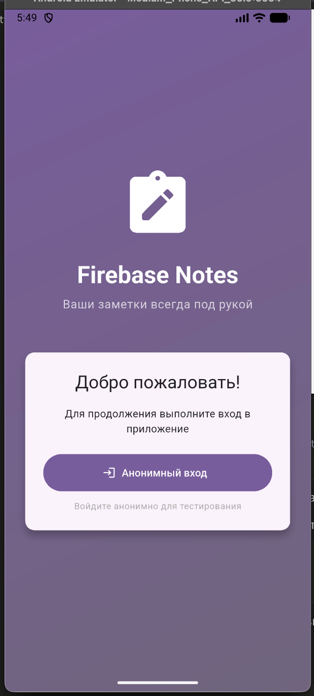
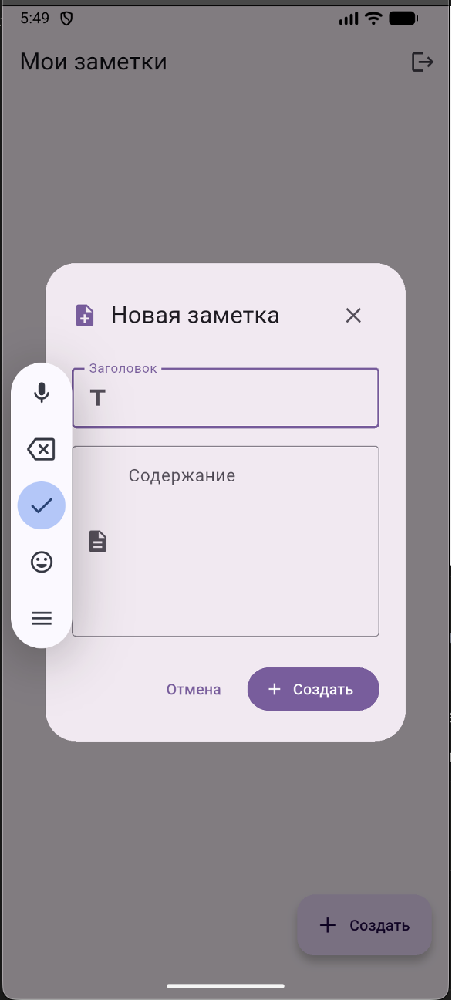
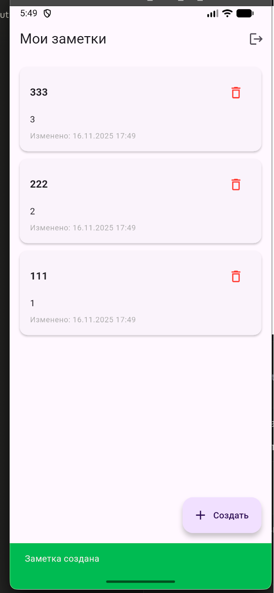
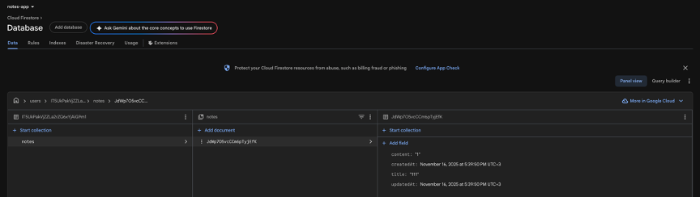

# Firebase Notes App

Мобильное приложение для управления заметками с использованием Firebase Cloud Firestore и Firebase Authentication.

## Создание и привязка Firebase-проекта

### Установка FlutterFire CLI

```bash
dart pub global activate flutterfire_cli
```

### Создание проекта

```bash
flutter create firebase_notes_app
cd firebase_notes_app
```

### Настройка Firebase

```bash
flutterfire configure
```

Процесс конфигурации:
- Выбран проект Firebase в консоли
- Указаны платформы: Android, iOS, Web
- Автоматически созданы конфигурационные файлы:
  - android/app/google-services.json
  - ios/Runner/GoogleService-Info.plist
  - lib/firebase_options.dart

## Использованные пакеты

```yaml
dependencies:
  firebase_core: ^3.6.0
  cloud_firestore: ^5.4.4
  firebase_auth: ^5.3.1
  intl: ^0.19.0
```

## Инициализация Firebase

```dart
void main() async {
  WidgetsFlutterBinding.ensureInitialized();
  
  await Firebase.initializeApp(
    options: DefaultFirebaseOptions.currentPlatform,
  );
  
  runApp(const NotesApp());
}
```

## Структура коллекций

```
users/
  {userId}/
    notes/
      {noteId}/
        title: string
        content: string
        createdAt: timestamp
        updatedAt: timestamp
```

Каждый пользователь имеет личную коллекцию заметок в подколлекции notes.

## Правила безопасности Firestore

### Почему тестовые правила недостаточны

Тестовый режим (allow read, write: if true) разрешает любые операции без проверки аутентификации и валидации данных.

### Используемые правила

```javascript
rules_version = '2';
service cloud.firestore {
  match /databases/{database}/documents {
    match /users/{userId} {
      allow read, write: if request.auth != null && request.auth.uid == userId;
      
      match /notes/{noteId} {
        allow read, write: if request.auth != null && request.auth.uid == userId;
        
        allow create: if request.auth != null 
                      && request.auth.uid == userId
                      && request.resource.data.title is string
                      && request.resource.data.title.size() >= 3
                      && request.resource.data.title.size() <= 100
                      && request.resource.data.content is string
                      && request.resource.data.content.size() <= 5000;
        
        allow update: if request.auth != null 
                      && request.auth.uid == userId
                      && request.resource.data.title.size() >= 3
                      && request.resource.data.content.size() <= 5000;
      }
    }
  }
}
```

Правила обеспечивают:
- Доступ только для авторизованных пользователей
- Изоляция данных между пользователями
- Валидация длины заголовка (3-100 символов)
- Валидация содержания (до 5000 символов)

## Возникшие проблемы и решения

### FlutterFire CLI не найден

Проблема: bash: flutterfire: command not found

Решение: Добавить pub cache в PATH
```bash
export PATH="$PATH":"$HOME/.pub-cache/bin"
```

### Ошибка инициализации Firebase

Проблема: No Firebase App has been created

Решение: Убедиться что Firebase.initializeApp вызывается с await до runApp

### Permission denied в Firestore

Проблема: Missing or insufficient permissions

Решение: 
- Проверить анонимную аутентификацию
- Опубликовать правила безопасности в консоли
- Использовать правильный путь users/{uid}/notes

### Ошибка сборки Android

Проблема: processDebugGoogleServices failed

Решение: Проверить наличие google-services плагина в android/app/build.gradle:
```gradle
apply plugin: 'com.google.gms.google-services'
```

### Заметки не обновляются автоматически

Проблема: Список не обновляется при изменениях

Решение: Использовать snapshots() вместо get() в StreamBuilder

## Скриншоты

Экран входа:


Пустой список заметок:


Создание заметки:


Список заметок:


Редактирование заметки:


Firebase Authentication:


Firebase Firestore:


Security Rules:


## Реализованный функционал

- Анонимная аутентификация
- Создание заметок с валидацией
- Редактирование заметок
- Удаление с подтверждением
- Real-time обновление списка
- Личные коллекции для каждого пользователя
- Правила безопасности Firestore
- Обработка ошибок

## Запуск проекта

```bash
flutter pub get
flutter run
```